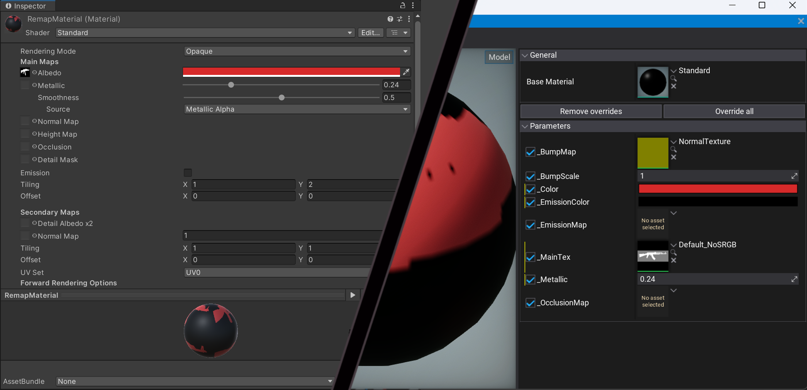

# HarmonyMigrationTools
 **Harmony Migration Tools** is a library of tools and namespaces meant to provide a base layer of compatibility for Unity programmers, looking to port their projects to the Flax Engine.

 The goal is NOT to change how you interact with Flax, but to provide basic support as the project slowly adapts to its new engine. Many functions in this library will be slower than their Unity equivalents and should only be used for testing purposes. After the initial migration, you are encouraged to fully switch to FlaxEngine functions. 

 ## Scripting

 This project is still in the early stages of development and contributions are welcome.

 Use the namespace `HarmonyMigrationTools` to access scripting compatibility functions.

 For a quick cheat-sheet on Unity-to-Flax functions as you port your game, see here:
 https://docs.google.com/spreadsheets/d/1g-8eEEuDxBcz9NEEipNg1gVXity0qfpN3iQbEqhTBKU/edit?usp=sharing 

 ## Assets
 More to be determined soon.
